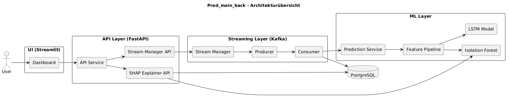

# PredMain
Obacht! Derzeit ist die aktuellste Version in pred_main_back. 
Um es auszuführen einfach im Terminal:
- docker compose -v
- docker compose up --build
- 

Zum Ändern des UML Link in https://www.plantuml.com kopieren:
//www.plantuml.com/plantuml/png/XL91ZjD04BpFArfxOJdi4q1hGG8HTjQi4u64KDInEyueunbhfWsi419_u3lS-0almPw9vOd4hdDoLvMhA-wwTOoMkqO9TvAwHOiDbAPfZIRD1Jye0aibewuLHP8MonFMzBZ07R4oNwMkuO3AaL1qO603LjP7XaeExqYZXM39lKLkgTerAFLktpl3tv-_8B7bKJATkBD_Vk_9EbaUMGWisLZOEh92d5F0rNO5rmLRmaP9Vdu5tmNqlq-lqHtt1ctr6T119tVL28WVqTj9le8K7yZ2zH8Tz-DaCN05sI-o96-2hGn4M0SPwjx3Gg_plFFmRfAzJN9OV6iLIXt9A21U5qS9hbBNOw1tU3ZX52UtfkfAijwaFG-1UcMqwvepLPw7_sMDSpO1kiYGfM5vj9GgwSzryIdQuMOk046O5fiCCbEHyWBbk0d4oXc5tc1fB3dsj7Gci4j2xYn1BbjIKWVtGm3T4Ar2nZswFbjk7DUMYlVfrI2gza8yWnUF_NfkMopkOPdUVNXIDzG9RcvUNdOa7ZoBhPpRrn_OhokUrFL6tZ1gomZ5pH0Z7ycZeyLZo3zLOYPciRbV9Dbg_MR-smJBu3_rQdpmQDo4IsR-G5aw7o7s7sodSemF7lLzYn5ViPdzYuzvcgoJpUfkFHyaEixuzo9eMdbBkkeQzGy0
